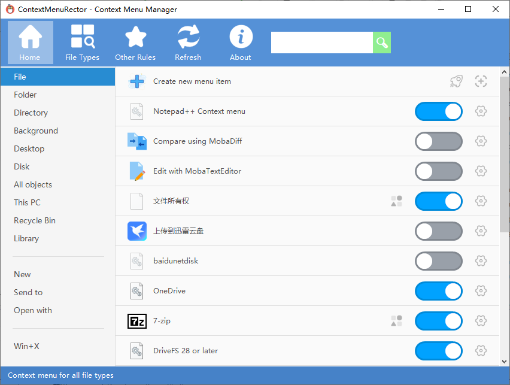
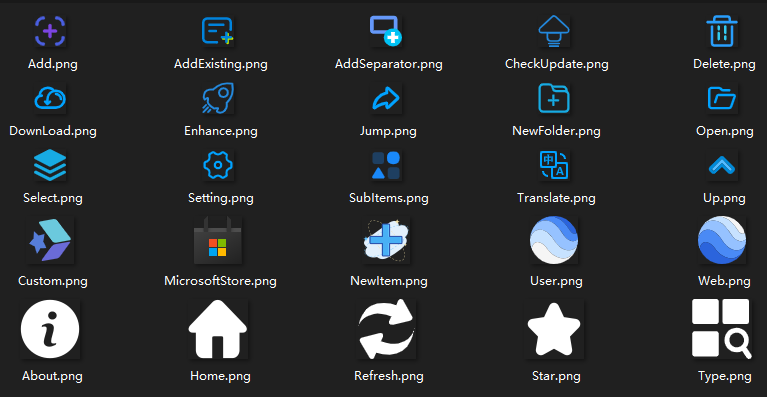

**English** | **[简体中文](Docs/README_zh-CN.md)**

# ContextMenuRector

## A free context menu manager for Windows.

## You can easily manage your Windows 🖱️ right-click context menu items with this software.

> This project ContextMenuRector is based on the long term inactive project [ContextMenuManager](https://github.com/BluePointLilac/ContextMenuManager/)。

## Latest Release Note: ContextMenuRector v1.0.0

Release date: 2026.09.15

### This release bringing 3 important updates and other improvements and bug fixes:

#### 1. Framework Migration

**Migrated the development framework from .NET Framework 4.8 to .NET 10**. **.NET 10** can bring better support for modern Windows.

#### 2. Search/Filter Function for Item Lists

**Added search/filter feature for menu item lists**. Now you can filter the items you want by keywords.

#### 3. Better internationalization support

- Make English as the default display language

- Change some Chinese comments in the source code to English

#### 4. Other improvements and fixes

**Welcome feedback, issue reports, and pull requests ❤.**

- [Report Issues](https://github.com/guanglinn/ContextMenuRector/issues)
- [Discussions](https://github.com/guanglinn/ContextMenuRector/discussions)
- [Pull Requests](https://github.com/guanglinn/ContextMenuRector/pulls)

## Installation

Download this software here [Github Releases][https://github.com/guanglinn/ContextMenuRector/releases ], then open the .exe file to install it.

## Key features
* Enable and disable context menu options for files, folders, submenus (e.g. Open, Send to), Internet Explorer, and Win+X.
* Modify menu names and icons.
* Delete context menu entries.
* Navigate menus in the registry or File Explorer.
* Add custom menu items and commands.

## Screenshots

## Updates
* Program and dictionary updates can be installed within the program, overwriting the original files.
* Due to limitations with Github and Gitee Raw, the program can only check for updates once a month.  The latest updates can always be found on [Github Releases][GitHub Releases].

## Notes
* Some special menu items (Shell extensions, file encryption) may not be displayed in the context menu, but will still show as enabled within the program; this is normal.

* Different context menu manager programs may use different methods for disabling menu options. Using multiple managers at the same time is not recommended. While other programs may use destructive methods, this program utilizes the registry keys provided by the system to hide menu items when possible.

  If you have used other context menu managers in the past, use that program to restore the menu items before using this one in order to avoid any potential issues.

* This program is not designed to perform clean uninstalls; however, it can help you find the registry and file locations of menu items so that they can be modified. If you are not familiar with such operations, it is recommended you use the enable/disable functions only.

## Third-party resources usage statement

* Main program icon: [EasyIcon](https://www.easyicon.cc/)

* Button icons: [Iconfont](https://www.iconfont.cn/)

  

